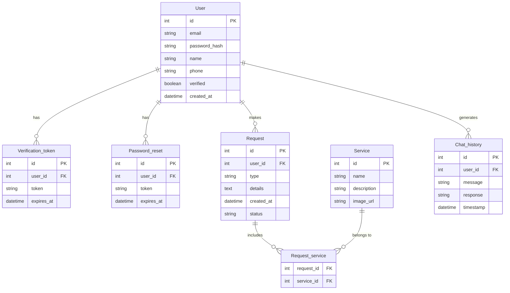

# 🏗️ Ristrutturazioni Morcianesi – Progetto di Informatica 2024/2025

### 👨‍🎓 Progetto Fine Anno - 5° Superiore
Autore: **Vullnet Sejdi**  
Anno scolastico: **2024/2025**

---

## 📌 Descrizione del Progetto

**"Ristrutturazioni Morcianesi"** è un sito web realizzato per promuovere i servizi di ristrutturazione edilizia offerti da mio padre, **Shinasi Sejdi**, con oltre 20 anni di esperienza nel settore.  
L’obiettivo è fornire una piattaforma moderna, intuitiva e interattiva per clienti interessati a ristrutturazioni, con strumenti di contatto, preventivo rapido tramite AI, e un'interfaccia responsive.

---

## 🚧 Stato del Progetto

Il progetto è in **fase di sviluppo avanzato**, con molte funzionalità già completate:

### ✅ Funzionalità già implementate

#### 🔐 Sistema di Autenticazione
- Registrazione utente con validazione input
- Verifica email tramite token
- Login e logout
- Recupero password
- Protezione CSRF

#### 🤖 Chat AI per Preventivi
- Integrazione con **OpenRouter/OpenAI**
- UI moderna con animazioni
- Chat disponibile anche in finestra separata
- Cronologia chat persistente
- Risposte personalizzate in base all’orario (es. "Buongiorno")

#### 🎨 Frontend Responsive
- Design moderno con CSS personalizzato
- Adattivo per dispositivi mobili e desktop
- Scroll effects e animazioni
- Layout a sezioni per la homepage

#### 📬 Sistema di Contatto
- Form per informazioni e preventivi
- Invio automatico di email di conferma

#### 🗃️ Database
- Schema SQL implementato
- Tabelle per utenti, richieste e cronologia chat
- Script `init_db.py` per inizializzazione

---

### ⏳ Funzionalità da completare

- [ ] Completare testi descrittivi nei servizi
- [ ] Aggiunta immagini reali alla galleria
- [ ] Testimonianze clienti
- [ ] Area amministratore per gestione richieste
- [ ] Statistiche e gestione avanzata errori
- [ ] Miglioramenti SEO (meta tag, immagini, compressione file)

---

## 📌 Analisi

Le entità principali identificate sono:

- `User`: gestisce l’autenticazione e la personalizzazione dell’esperienza utente
- `Service`: rappresenta i servizi offerti
- `Request`: gestisce le richieste di preventivi o informazioni
- `AI_Chat`: sistema intelligente di assistenza per preventivi automatici

---

## 🧩 Tabelle del Database

- `users`
- `verification_tokens`
- `password_reset`
- `services`
- `requests`
- `request_services` *(tabella di join)*
- `chat_history`

### 🔗 Relazioni

- **User 1-N Request**: un utente può effettuare più richieste
- **Service N-M Request**: una richiesta può coinvolgere più servizi e viceversa (tramite `request_services`)
- **User 1-N Chat_history**: un utente può avere molteplici interazioni con la chat AI

---

### 📊 ER Diagram (Entity Relationship)



---

## 🧠 Schema Logico

```sql
Users(id, email, password_hash, name, phone, verified, created_at)  
Verification_tokens(id, user_id [FK], token, expires_at)  
Password_reset(id, user_id [FK], token, expires_at)  
Services(id, name, description, image_url)  
Requests(id, user_id [FK], type, details, created_at, status)  
Request_services(request_id [FK], service_id [FK])  
Chat_history(id, user_id [FK], message, response, timestamp)
```

---

## 🛠️ SQL - Creazione Tabelle

```sql
CREATE TABLE users (
    id INTEGER PRIMARY KEY AUTOINCREMENT,
    email VARCHAR(100) NOT NULL UNIQUE,
    password_hash VARCHAR(255) NOT NULL,
    name VARCHAR(100),
    phone VARCHAR(20),
    verified BOOLEAN DEFAULT 0,
    created_at TIMESTAMP DEFAULT CURRENT_TIMESTAMP
);

CREATE TABLE verification_tokens (
    id INTEGER PRIMARY KEY AUTOINCREMENT,
    user_id INTEGER NOT NULL,
    token VARCHAR(100) NOT NULL,
    expires_at TIMESTAMP NOT NULL,
    FOREIGN KEY (user_id) REFERENCES users(id)
);

CREATE TABLE password_reset (
    id INTEGER PRIMARY KEY AUTOINCREMENT,
    user_id INTEGER NOT NULL,
    token VARCHAR(100) NOT NULL,
    expires_at TIMESTAMP NOT NULL,
    FOREIGN KEY (user_id) REFERENCES users(id)
);

CREATE TABLE services (
    id INTEGER PRIMARY KEY AUTOINCREMENT,
    name VARCHAR(100) NOT NULL,
    description TEXT,
    image_url VARCHAR(255)
);

CREATE TABLE requests (
    id INTEGER PRIMARY KEY AUTOINCREMENT,
    user_id INTEGER NOT NULL,
    type VARCHAR(50) NOT NULL,
    details TEXT,
    created_at TIMESTAMP DEFAULT CURRENT_TIMESTAMP,
    status VARCHAR(20) DEFAULT 'pending',
    FOREIGN KEY (user_id) REFERENCES users(id)
);

CREATE TABLE request_services (
    request_id INTEGER NOT NULL,
    service_id INTEGER NOT NULL,
    PRIMARY KEY (request_id, service_id),
    FOREIGN KEY (request_id) REFERENCES requests(id),
    FOREIGN KEY (service_id) REFERENCES services(id)
);

CREATE TABLE chat_history (
    id INTEGER PRIMARY KEY AUTOINCREMENT,
    user_id INTEGER,
    message TEXT NOT NULL,
    response TEXT NOT NULL,
    timestamp TIMESTAMP DEFAULT CURRENT_TIMESTAMP,
    FOREIGN KEY (user_id) REFERENCES users(id)
);
```

---

## 📥 Esempio di Dati - Servizi

```sql
INSERT INTO services (name, description, image_url) VALUES
    ('Ristrutturazione completa', 'Ristrutturazione completa di appartamenti e case', '/static/images/services/ristrutturazione_completa.jpg'),
    ('Rifacimento bagni', 'Rifacimento completo o parziale di bagni', '/static/images/services/bagno.jpg'),
    ('Rifacimento cucine', 'Rifacimento completo o parziale di cucine', '/static/images/services/cucina.jpg'),
    ('Opere murarie', 'Demolizioni, costruzioni e modifiche di pareti', '/static/images/services/muratura.jpg'),
    ('Impianti idraulici', 'Installazione e manutenzione di impianti idraulici', '/static/images/services/idraulica.jpg'),
    ('Impianti elettrici', 'Installazione e manutenzione di impianti elettrici', '/static/images/services/elettrica.jpg'),
    ('Pavimentazioni', 'Posa di pavimenti in ceramica, legno, gres', '/static/images/services/pavimento.jpg'),
    ('Rivestimenti', 'Posa di rivestimenti per pareti interne ed esterne', '/static/images/services/rivestimento.jpg'),
    ('Controsoffitti', 'Installazione di controsoffitti in cartongesso', '/static/images/services/controsoffitto.jpg'),
    ('Pitture e decorazioni', 'Tinteggiatura e decorazione di pareti', '/static/images/services/pittura.jpg'),
    ('Facciate esterne', 'Rifacimento e ristrutturazione di facciate', '/static/images/services/facciata.jpg');
```

---

## 🧰 Tecnologie Utilizzate

- **Python 3.9+**
- **Flask** – Backend Web Framework
- **SQLite** – Database leggero locale
- **HTML5 / CSS3 / Bootstrap** – Layout e stile
- **JavaScript** – Animazioni e interattività
- **OpenRouter API** – Assistente AI integrato
- **Flask-Mail / SMTP** – Sistema invio email

---

## 📁 Struttura del Progetto

```bash
ristrutturazioni_morcianesi/
│
├── app.py                      # File principale Flask con rotte e logica dell'applicazione
├── init_db.py                  # Script per inizializzare il database
├── schema.sql                  # Schema SQL per la creazione delle tabelle
├── database.db                 # Database SQLite
│
├── __pycache__/                # File compilati Python
│   └── app.cpython-313.pyc
│
├── templates/                  # Template HTML
│   ├── base.html              # Template base con header e footer
│   ├── chat.html              # Pagina chat standalone
│   ├── forgot_password.html   # Pagina recupero password
│   ├── home.html              # Homepage del sito
│   ├── login.html             # Pagina di login
│   ├── register.html          # Pagina di registrazione
│   ├── resend_verification.html # Pagina rinvio email verifica
│   ├── reset_password.html    # Pagina reset password
│   ├── errors/                # Pagine di errore personalizzate
│   │   ├── 404.html          # Pagina 404 - Not Found
│   │   └── 500.html          # Pagina 500 - Server Error
│   └── partials/              # Componenti HTML riutilizzabili
│
└── static/                     # File statici
    ├── favicon/               # Icone per la UI
    │   ├── favicon.ico        # Favicon principale del sito
    │   ├── gmail.ico          # Icona Gmail
    │   ├── map.ico            # Icona mappa
    │   ├── personal_area.ico  # Icona area personale
    │   └── phone.ico          # Icona telefono
    │
    ├── fonts/                 # Font personalizzati
    │
    ├── images/                # Immagini del sito
    │   ├── casavistamareristrutturataconfinestre.png
    │   ├── chat-logo.png      # Logo per la chat
    │   ├── chi_siamo.png      # Immagine sezione Chi Siamo
    │   └── Logo_RistrutturazioniMorcianesi.png  # Logo aziendale
    │
    ├── script/                # File JavaScript
    │   ├── chat.js            # Gestione chat AI
    │   ├── registration_and_login.js  # Validazione form
    │   └── scroll_effect.js   # Effetti UI durante lo scroll
    │
    └── style/                 # File CSS
        ├── style.css          # File CSS principale (importa moduli)
        ├── style_login_registration.css  # Stile pagine autenticazione 
        └── modules/           # Moduli CSS specializzati
            ├── style_chat.css # Stile widget chat
            ├── variables.css  # Variabili e reset
            ├── typography.css # Tipografia
            ├── layout.css     # Layout base
            ├── navbar.css     # Barra di navigazione
            ├── buttons.css    # Pulsanti e CTA
            ├── sections.css   # Sezioni principali
            ├── about.css      # Sezione Chi Siamo
            ├── footer.css     # Footer e contatti
            └── responsive.css # Media queries
```

---

## ⚙️ Istruzioni per l’Installazione

### ✅ Prerequisiti
- Python 3.9 o superiore
- pip
- Git (opzionale)

### 1. Clona il repository
```bash
git clone https://github.com/vullnetsejdii/Progetto_FineAnno_Informatica.git
cd Progetto_FineAnno_Informatica
```

_Oppure scarica come ZIP ed estrai._

---

### 2. Crea ambiente virtuale

**Windows:**
```bash
python -m venv venv
venv\Scripts\activate
```

**Linux/macOS:**
```bash
python3 -m venv venv
source venv/bin/activate
```

---

### 3. Installa le dipendenze
```bash
pip install flask flask-mail flask-wtf email_validator requests python-dotenv werkzeug==2.3.7
```

---

### 4. Crea file \`.env\`

```env
SECRET_KEY=chiave_segreta_per_flask
MAIL_SERVER=smtp.example.com
MAIL_PORT=587
MAIL_USERNAME=tuoemail@example.com
MAIL_PASSWORD=password_email
MAIL_USE_TLS=True
MAIL_DEFAULT_SENDER=tuoemail@example.com
OPENROUTER_API_KEY=chiave_api_openrouter
```

---

### 5. Inizializza il database
```bash
python init_db.py
```

---

### 6. Avvia l'applicazione
```bash
python app.py
```

---

### 7. Visita il sito
Apri il browser su:
```
http://localhost:5000
```

---

## 🛠️ Risoluzione Problemi Comuni

- **ModuleNotFoundError**  
  ➤ Assicurati di aver attivato l’ambiente virtuale  
  ➤ Esegui: \`pip install -r requirements.txt\`

- **Errore database**  
  ➤ Verifica esecuzione \`init_db.py\`  
  ➤ Controlla permessi nella cartella \`instance/\`

- **Email non inviate**  
  ➤ Verifica configurazione SMTP  
  ➤ Controlla accesso applicazioni meno sicure

- **Problemi OpenRouter API**  
  ➤ Controlla validità chiave API  
  ➤ Verifica credito sull'account

---

## 📌 GitHub

[🔗 Progetto su GitHub](https://github.com/vullnetsejdii/Progetto_FineAnno_Informatica)


---

## 👨‍💻 Autore

**Vullnet Sejdi**  
Classe **5° Superiore**, A.S. **2024/2025**
